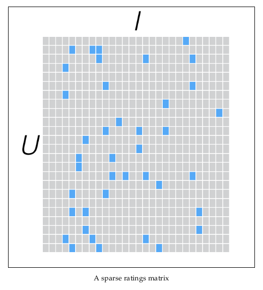
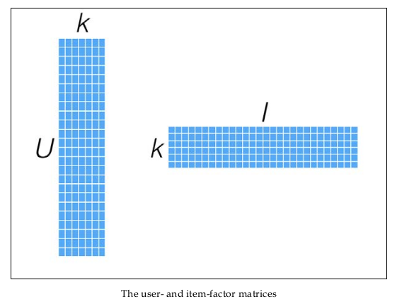

**ALS（Alternating Least
Squares）**算法是基于矩阵分解的协同过滤算法中的一种，在sOven
的oryx框架中，推荐算法便是采用的这种算法。\
首先说矩阵分解，这里的矩阵分解可以理解为，将一个m×n的矩阵S分解为一个m×k的矩阵X和n×
k的矩阵Y的转置的乘积的近似值\
\
ALS算法的核心就是将稀疏评分矩阵分解为用户特征向量矩阵和产品特征向量矩阵的乘积交替使用最小二乘法逐步计算用户/产品特征向量，使得差平方和最小通过用户/产品特征向量的矩阵来预测某个用户对某个产品的评分\
ALS算法的缺点在于：

    1.它是一个离线算法。
    2.无法准确评估新加入的用户或商品。这个问题也被称为Cold Start问题。

{width="600"}\
{width="600"}\
<https://bugra.github.io/work/notes/2014-04-19/alternating-least-squares-method-for-collaborative-filtering/>
