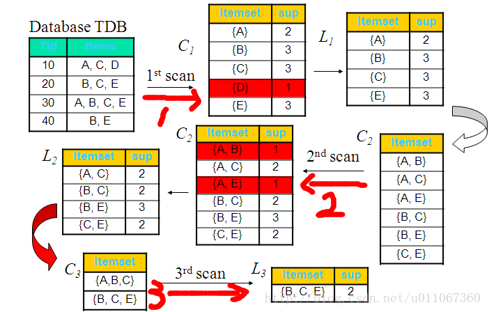

**Apriori** 算法概述\
\
Apriori 算法是一种最有影响力的挖掘布尔关联规则的频繁项集的
算法，它是由Rakesh Agrawal 和RamakrishnanSkrikant
提出的。它使用一种称作逐层搜索的迭代方法，k- 项集用于探索（k+1）-
项集。首先，找出频繁 1- 项集的集合。该集合记作L1。L1 用于找频繁2-
项集的集合 L2，而L2 用于找L2，如此下去，直到不能找到 k- 项集。每找一个
Lk 需要一次数据库扫描。为提高频繁项集逐层产生的效率，一种称作Apriori
性质的重 要性质
用于压缩搜索空间。其运行定理在于一是频繁项集的所有非空子集都必须也是频繁的，二是非频繁项集的所有父集都是非频繁的。\
\
**关联分析的基本概念**\
\
\* 支持度
关联规则A-\>B的支持度support=P(AB)，指的是事件A和事件B同时发生的概率。

-   置信度

置信度confidence=P(B\|A)=P(AB)/P(A),指的是发生事件A的基础上发生事件B的概率。比如说在规则Computer
=\> antivirus_software , 其中 support=2%,
confidence=60%中，就表示的意思是所有的商品交易中有2%的顾客同时买了电脑和杀毒软件，并且购买电脑的顾客中有60%也购买了杀毒软件。

-   k项集

如果事件A中包含k个元素，那么称这个事件A为k项集，并且事件A满足最小支持度阈值的事件称为频繁k项集。

-   数字列表项目由频繁项集产生强关联规则\
    1）K维数据项集LK是频繁项集的必要条件是它所有K-1维子项集也为频繁项集，记为LK-1　\
    2）如果K维数据项集LK的任意一个K-1维子集Lk-1，不是频繁项集，则K维数据项集LK本身也不是最大数据项集。\
    3）Lk是K维频繁项集，如果所有K-1维频繁项集合Lk-1中包含LK的K-1维子项集的个数小于K，则Lk不可能是K维最大频繁数据项集。\
    4）同时满足最小支持度阀值和最小置信度阀值的规则称为强规则。\
    \
    {width="600"}
