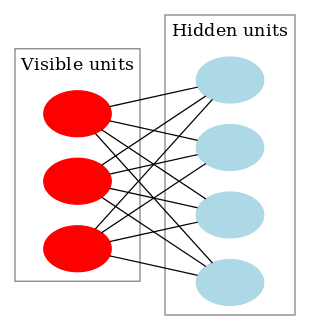

**受限玻尔兹曼机**（英语：restricted Boltzmann machine,
RBM）是一种可通过输入数据集学习概率分布的随机生成神经网络。RBM最初由发明者保罗·斯模棱斯基于1986年命名为簧风琴（Harmonium）\[1\]，但直到杰弗里·辛顿及其合作者在2000年代中叶发明快速学习算法后，受限玻兹曼机才变得知名。受限玻兹曼机在降维\[2\]、分类\[3\]、协同过滤、特征学习\[4\]和主题建模\[5\]中得到了应用。根据任务的不同，受限玻兹曼机可以使用监督学习或无监督学习的方法进行训练。\
正如名字所提示的那样，受限玻兹曼机是一种玻兹曼机的变体，但限定模型必须为二分图。模型中包含对应输入参数的输入（可见）单元和对应训练结果的隐单元，图中的每条边必须连接一个可见单元和一个隐单元。（与此相对，"无限制"玻兹曼机包含隐单元间的边，使之成为递归神经网络。）这一限定使得相比一般玻兹曼机更高效的训练算法成为可能，特别是基于梯度的对比分歧（contrastive
divergence）。

受限玻兹曼机也可被用于深度学习网络。具体地，深度信念网络可使用多个RBM堆叠而成，并可使用梯度下降法和反向传播算法进行调优。\
\
包含三个可见单元和四个隐单元的受限玻兹曼机示意图（不包含偏置节点）\
\
{width="400"}
