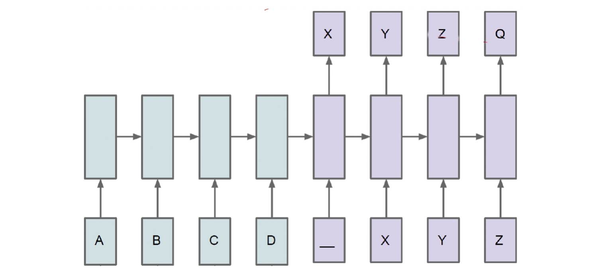
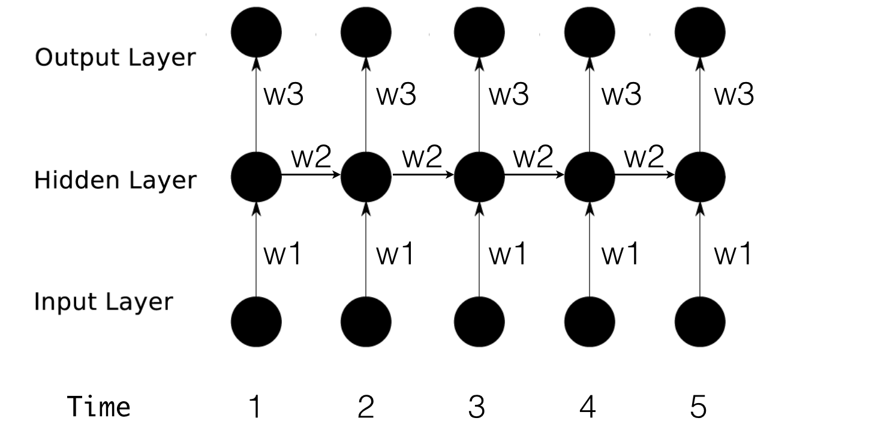

**递归神经网络（RNN）**是两种人工神经网络的总称。一种是时间递归神经网络（recurrent
neural network），另一种是结构递归神经网络（recursive neural
network）。时间递归神经网络的神经元间连接构成矩阵，而结构递归神经网络利用相似的神经网络结构递归构造更为复杂的深度网络。RNN一般指代时间递归神经网络。单纯递归神经网络因为无法处理随着递归，权重指数级爆炸或消失的问题（Vanishing
gradient
problem），难以捕捉长期时间关联；而结合不同的LSTM可以很好解决这个问题。\
\
时间递归神经网络可以描述动态时间行为，因为和前馈神经网络（feedforward
neural
network）接受较特定结构的输入不同，RNN将状态在自身网络中循环传递，因此可以接受更广泛的时间序列结构输入。手写识别是最早成功利用RNN的研究结果\
\
\
{width="600"}\
{width="600"}\
{width="600"}\
{width="600"}\
\
<https://en.wikipedia.org/wiki/Recurrent_neural_network>
<http://blog.csdn.net/Dark_Scope/article/details/47056361>
