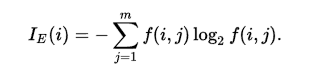
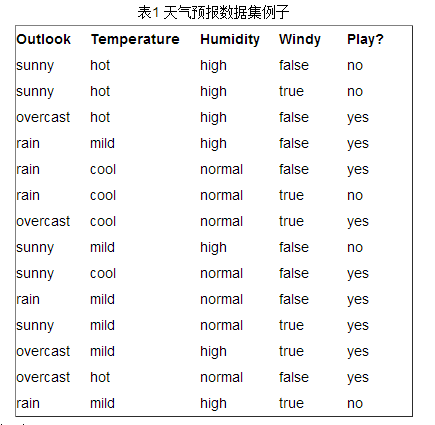
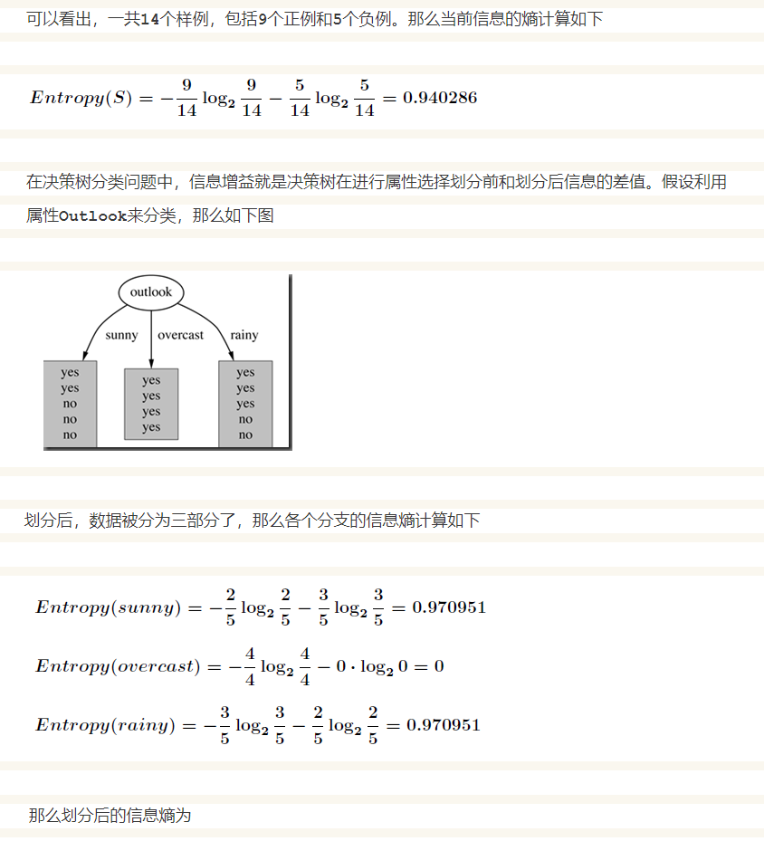
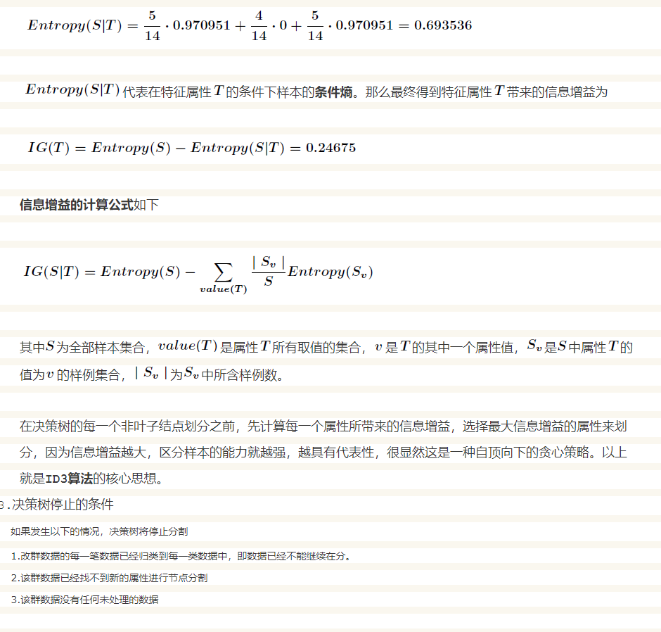

**ID3算法**（Iterative Dichotomiser 3 迭代二叉树3代）是一个由Ross
Quinlan发明的用于决策树的算法。\
这个算法是建立在奥卡姆剃刀的基础上：越是小型的决策树越优于大的决策树（简单理论）。尽管如此，该算法也不是总是生成最小的树形结构。而是一个启发式算法。奥卡姆剃刀阐述了一个信息熵的概念：\
\
这个ID3算法可以归纳为以下几点：\
\
使用所有没有使用的属性并计算与之相关的样本熵值\
选取其中熵值最小的属性\
生成包含该属性的节点\
关于ID3算法的实现可以参考C4.5算法，它同时也是ID3的升级版\
\
信息增益是针对一个一个特征而言的，就是看一个特征，系统有它和没有它时的信息量各是多少，两者
的差值就是这个特征给系统带来的信息量，即信息增益。\
\
\*\*
接下来以天气预报的例子来说明\*\*。下面是描述天气数据表，学习目标是play或者not
play。\
\
{width="400"}\
\
{width="600"}\
{width="600"}
