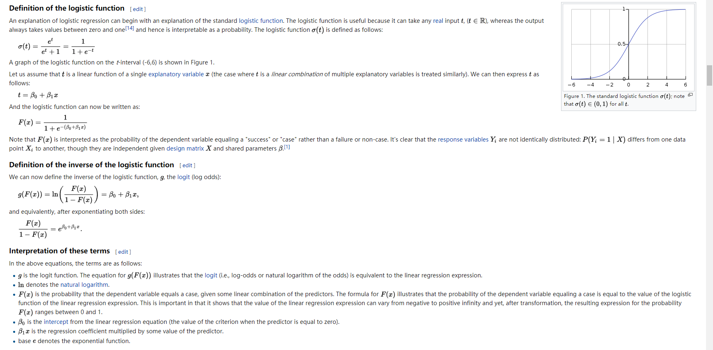

**In statistics, logistic regression, or logit regression, or logit
model\[1\]** is a regression model where the dependent variable (DV) is
categorical. This article covers the case of a binary dependent
variable---that is, where the output can take only two values, \"0\" and
\"1\", which represent outcomes such as pass/fail, win/lose, alive/dead
or healthy/sick. Cases where the dependent variable has more than two
outcome categories may be analysed in multinomial logistic regression,
or, if the multiple categories are ordered, in ordinal logistic
regression.\[2\] In the terminology of economics, logistic regression is
an example of a qualitative response/discrete choice model.\
\
\
<https://en.wikipedia.org/wiki/Logistic_regression>
