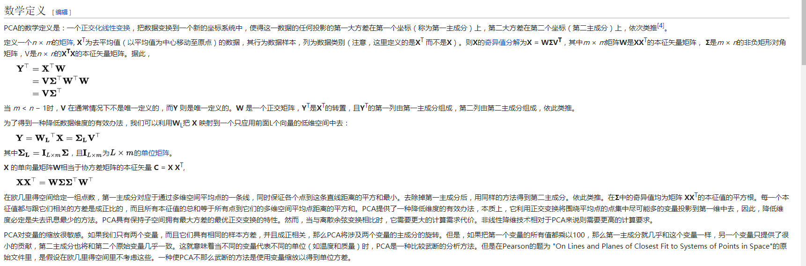

在多元统计分析中，**主成分分析（英语：Principal components
analysis，PCA）**是一种分析、简化数据集的技术。主成分分析经常用于减少数据集的维数，同时保持数据集中的对方差贡献最大的特征。这是通过保留低阶主成分，忽略高阶主成分做到的。这样低阶成分往往能够保留住数据的最重要方面。但是，这也不是一定的，要视具体应用而定。由于主成分分析依赖所给数据，所以数据的准确性对分析结果影响很大。\
\
主成分分析由卡尔·皮尔逊于1901年发明\[1\]，用于分析数据及建立数理模型。其方法主要是通过对协方差矩阵进行特征分解\[2\]，以得出数据的主成分（即特征向量）与它们的权值（即特征值\[3\]）。PCA是最简单的以特征量分析多元统计分布的方法。其结果可以理解为对原数据中的方差做出解释：哪一个方向上的数据值对方差的影响最大？换而言之，PCA提供了一种降低数据维度的有效办法；如果分析者在原数据中除掉最小的特征值所对应的成分，那么所得的低维度数据必定是最优化的（也即，这样降低维度必定是失去讯息最少的方法）。主成分分析在分析复杂数据时尤为有用，比如人脸识别。\
\
PCA是最简单的以特征量分析多元统计分布的方法。通常情况下，这种运算可以被看作是揭露数据的内部结构，从而更好的解释数据的变量的方法。如果一个多元数据集能够在一个高维数据空间坐标系中被显现出来，那么PCA就能够提供一幅比较低维度的图像，这幅图像即为在讯息最多的点上原对象的一个'投影'。这样就可以利用少量的主成分使得数据的维度降低了。\
PCA跟因子分析密切相关，并且已经有很多混合这两种分析的统计包。而真实要素分析则是假定底层结构，求得微小差异矩阵的特征向量。\
\
\
\
<http://blog.codinglabs.org/articles/pca-tutorial.html>
