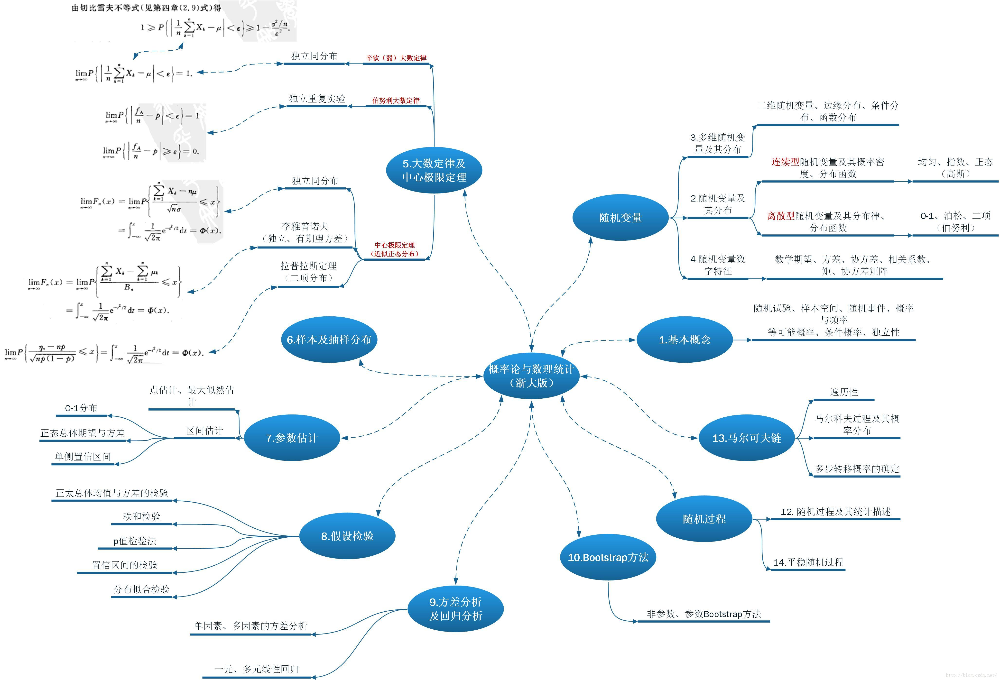

**概率论**（英语：Probability
theory）是集中研究概率及随机现象的数学分支，是研究随机性或不确定性等现象的数学。概率论主要研究对象为随机事件、随机变量以及随机过程。对于随机事件是不可能准确预测其结果的\[1\]，然而对于一系列的独立随机事件------例如掷骰子、扔硬币、抽扑克牌以及轮盘等，会呈现出一定的、可以被用于研究及预测的规律\[2\]，两个用来描述这些规律的最具代表性的数学结论分别是大数定律和中心极限定理。\
\

