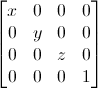
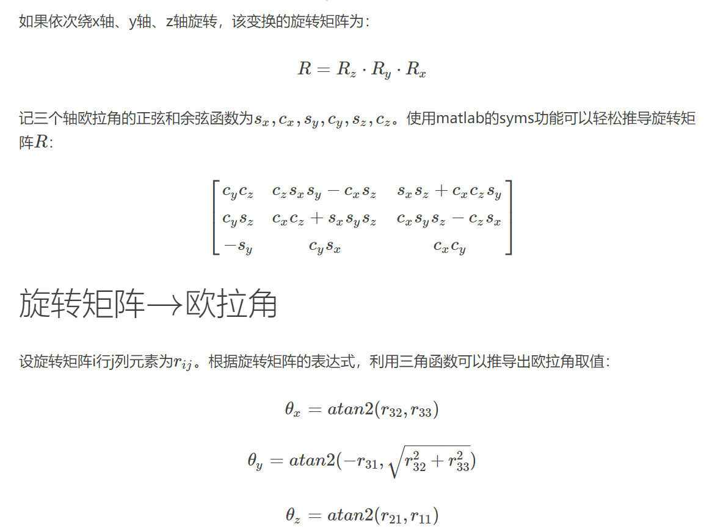
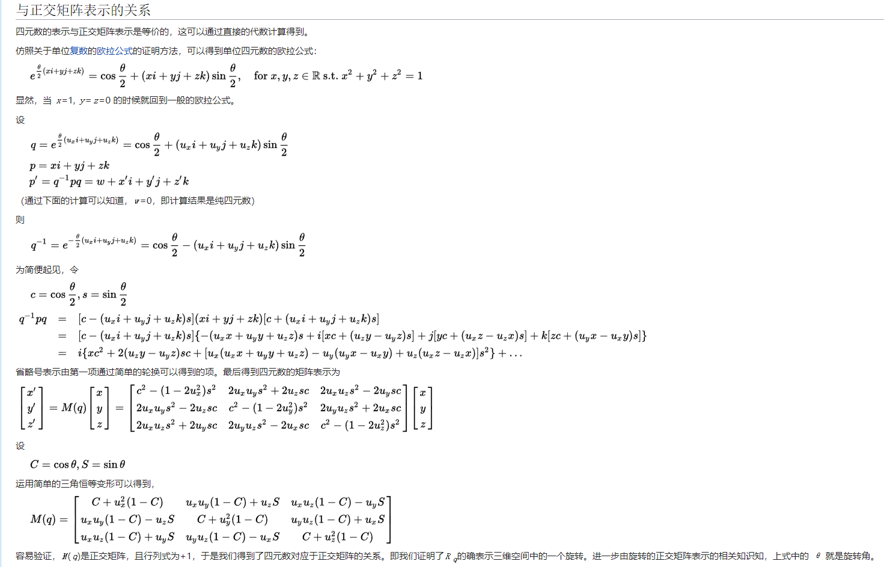

**平移矩阵**（Translation matrices）
平移矩阵是最简单的变换矩阵。平移矩阵是这样的：\
\
{width="150"}\
\
**缩放矩阵**（Scaling matrices）\
\
{width="150"}\
\
**MVP矩阵**：\
\
{width="150"}\
\
旋转矩阵：\
\
\
{width="500"}\
\
欧拉角：\
{width="500"}\
\
**四元数**：\
\
四元数是由爱尔兰数学家威廉·卢云·哈密顿在1843年创立出的数学概念。

从明确地角度而言，四元数是复数的不可交换延伸。如把四元数的集合考虑成多维实数空间的话，四元数就代表着一个四维空间，相对于复数为二维空间。

作为用于描述现实空间的坐标表示方式，人们在复数的基础上创造了四元数并以a+bi+cj+dk的形式说明空间点所在位置。
i、j、k作为一种特殊的虚数单位参与运算，并有以下运算规则：i0=j0=k0=1，i2=j2=k2=-1

对于i、j、k本身的几何意义可以理解为一种旋转，其中i旋转代表X轴与Y轴相交平面中X轴正向向Y轴正向的旋转，j旋转代表Z轴与X轴相交平面中Z轴正向向X轴正向的旋转，k旋转代表Y轴与Z轴相交平面中Y轴正向向Z轴正向的旋转，-i、-j、-k分别代表i、j、k旋转的反向旋转。\
\
{width="800"}
