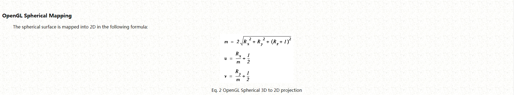

**Sphere mapping**\
Sphere mapping represents the sphere of incident illumination as though
it were seen in the reflection of a reflective sphere through an
orthographic camera. The texture image can be created by approximating
this ideal setup, or using a fisheye lens or via prerendering a scene
with a spherical mapping.\
\
The spherical mapping suffers from limitations that detract from the
realism of resulting renderings. Because spherical maps are stored as
azimuthal projections of the environments they represent, an abrupt
point of singularity (a "black hole" effect) is visible in the
reflection on the object where texel colors at or near the edge of the
map are distorted due to inadequate resolution to represent the points
accurately. The spherical mapping also wastes pixels that are in the
square but not in the sphere.\
\
The artifacts of the spherical mapping are so severe that it is
effective only for viewpoints near that of the virtual orthographic
camera.\
\

```
 SEM shader, per-vertex GLSL - Vertex shader source

varying vec2 vN;

void main() {

    vec4 p = vec4( position, 1. );

    vec3 e = normalize( vec3( modelViewMatrix * p ) );
    vec3 n = normalize( normalMatrix * normal );

    vec3 r = reflect( e, n );
    float m = 2. * sqrt(
      pow( r.x, 2. ) +
      pow( r.y, 2. ) +
      pow( r.z + 1., 2. )
    );
    vN = r.xy / m + .5;

    gl_Position = projectionMatrix * modelViewMatrix * p;

} 
```
 \
\
<http://www.reindelsoftware.com/Documents/Mapping/Mapping.html>\
https://www.clicktorelease.com/blog/creating-spherical-environment-mapping-shader/\
