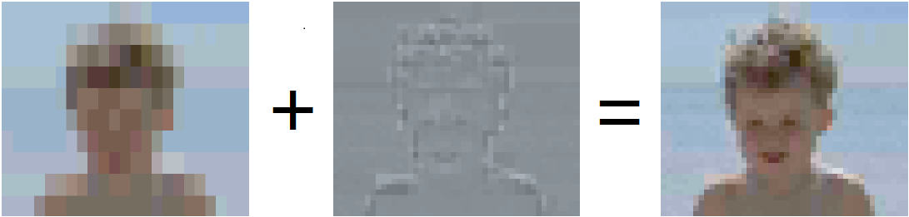

**ETC(**EricssonTexture
Compression)爱立信纹理压缩是2005年初与爱立信合作研
发的一种有损纹理压缩技术，是最通用的纹理压缩格式，几乎所有的安卓设备都可以支持ETC压缩的GPU加速。它是一种为感知质量设计的有损算法，其依据是人眼对亮度改变的反应要高于色度改变。\
\
\
\
ETC压缩算法采用将图像中的chromatic和luminance分开存储的方式，而在解码时使用luminance对chromatic进行调制进而重现原始图像信息\
\
**ETC1**:\
采用4x2的block进行分割（原始为4\*2\*24=192，压缩后为32，压缩率为6）\
\
**ETC2：**\
根据ETC1的实现方式，如果其块内的颜色分布不均匀的话，则其存储的两个basecolor会较远的分布于插值趋线的较远的两侧，进行解压后会得到较低的压缩质量，\
