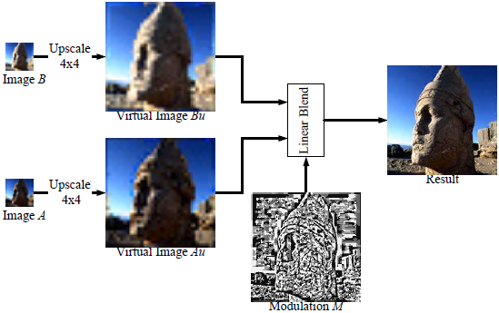

**PVRTC**的不是基于block的方式生成的，但是却也可以理解为以block方式组织的。其生成压缩后包含两张(w/4,h/4)大小的缩略图（w,h为原始图片的宽和高，可以理解为第4级的mipmap，但生成过程会比较mipmap的复杂），其中的每个pixel映射并对应到原始图像中的一个64x64的block上；然后使用1张与原始图像大小相同的modulate图，对应的每个pixel占2个bits，也即可对应四种调制方式，通过几种不同的调制方式还原出近似的原始像素值\
\
压缩后的一个4x4的block中的bits的组成内容为：

-   1bit：对应的融合方式，透明或不透明；
-   32bits：对应于16个pixel，每个pixel有2bits的调制因子；
-   31bits：对应两个缩略图中的该块映射到的两个像素上的颜色，若是透明模式，则两个颜色为RGBA44431，RGBA34431；若是不透明模式，则两个颜色为RGBA5551，RGBA4551;\
    
